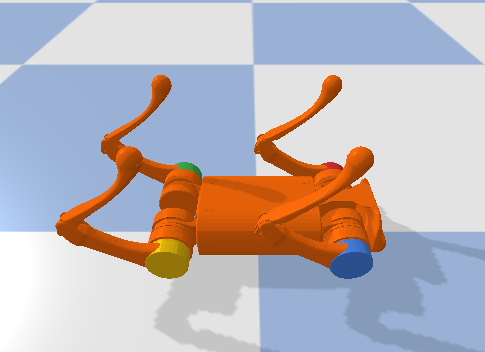

## Fall Recovery Challenge

Success rate of recovery from diverse terrains and a lying-down pose. Robot platform: A1.

Policies from: https://github.com/zita-ch/K-Access

Lying-Down Pose (dropped from origin):

The task examines how well the controller can recover from a fall on diverse terrains. The success is defined as : nominal_pose_reward > 0.55 * dt  within 8 seconds.

| policy                | success rate: hard | success rate: medium |
| --------------------- | ------------------ | -------------------- |
| K-Access 300 + 9-pose | 0.555              | 0.605                |
| Random                | 0.530              | 0.545                |

The results show that, it is still a long way to go if we want the robot to recover from diverse terrains.
