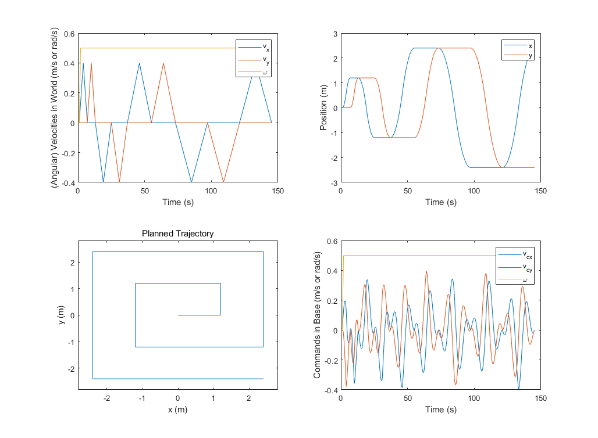

## Tracking Challenge

Survival time of tracking given velocity commands without derailing too much.

The task is defined as:

we want the robot base to follow the trajectory below, and the velocities and positions w.r.t. time in the world frame are provided in the figure below and in the file  [tracking.csv](tracking.csv) . Hence we derive the velocity commands for the robot base and also include them in the csv file.

The task examines how well the controller can overcome the terrains to track given velocities. The survival time before the position error goes above 0.4 is recorded as below.

| policy         | survival time: hard ( $\pm 1\sigma$ ) | survival time: medium ( $\pm 1\sigma$ ) |
| -------------- | ----------------------------------- | ------------------------------------- |
| anymal_c_rough | 11.76 $\pm$ 0.03 s                    | 13.05 $\pm$ 0.16 s                      |
| anymal_c_flat  | 8.30 $\pm$ 0.05 s                     | 8.82 $\pm$ 0.04 s                       |

The two policies are trained with the codes for https://leggedrobotics.github.io/legged_gym/ (legged_gym v1). The 'anymal_c_rough' policy is trained with rough terrains, while the 'anymal_c_flat' policy is trained with the flat terrain. We used some different hyperparameters for: num_envs=2048, num_steps_per_env = 48.
